# Mermaid Diagram Enhancement Plan

Analysis of documentation with recommendations for Mermaid diagram additions.

## Overview

This document identifies opportunities to replace ASCII diagrams with Mermaid diagrams throughout the MCP Gateway documentation for better visual clarity and maintainability.

## Priority 1: High-Impact Diagrams (Immediate)

### GETTING_STARTED.md

**1. Architecture Overview (Line ~60)**

```ascii
┌─────────────┐   ┌─────────────┐   ┌─────────────┐
│ Claude Code │   │ Claude      │   │   Cursor    │
│             │   │  Desktop    │   │             │
└──────┬──────┘   └──────┬──────┘   └──────┬──────┘
```

**Replace with:**

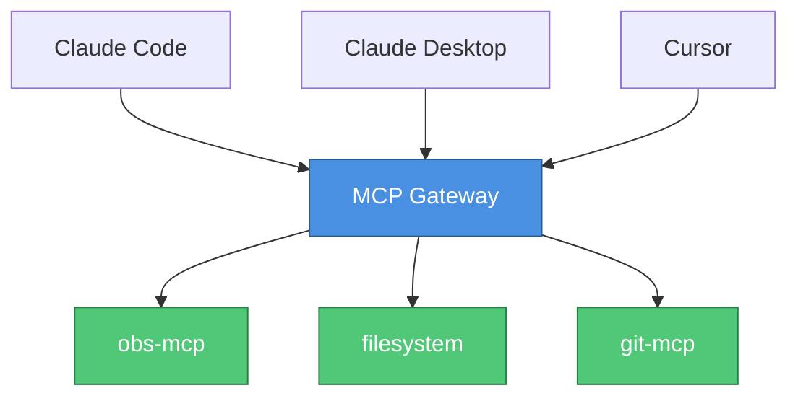

**2. OAuth Flow (Line ~580)**

```
User → IDP (Okta/Auth0) → SAML Assertion → MCP Gateway → Access Granted
```

**Replace with:**

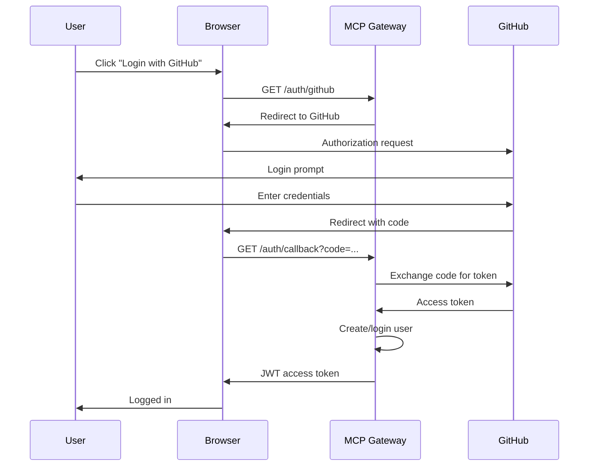

### USER_GUIDE.md

**3. Server Lifecycle State Machine (Line ~450)**

```
stopped → starting → running → idle → stopping → stopped
```

**Replace with:**

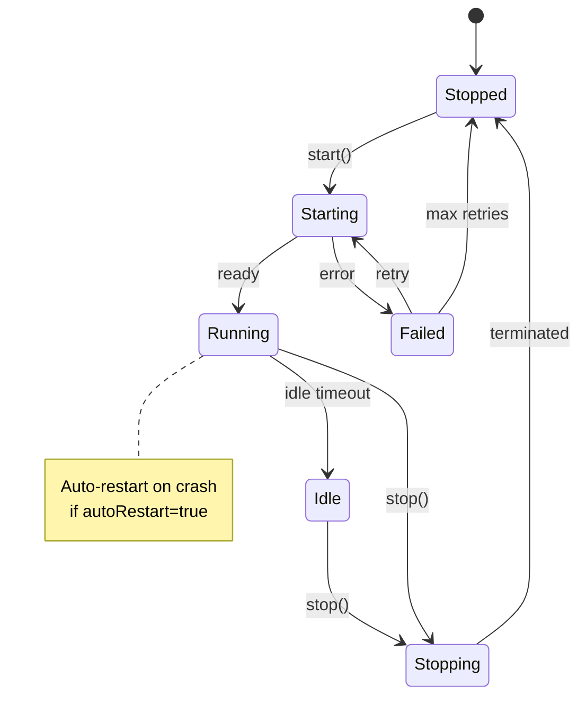

**4. Authentication Flow Comparison (Line ~250)**

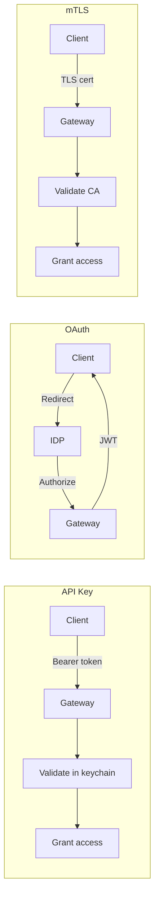

**5. RBAC Permission Hierarchy (Line ~620)**

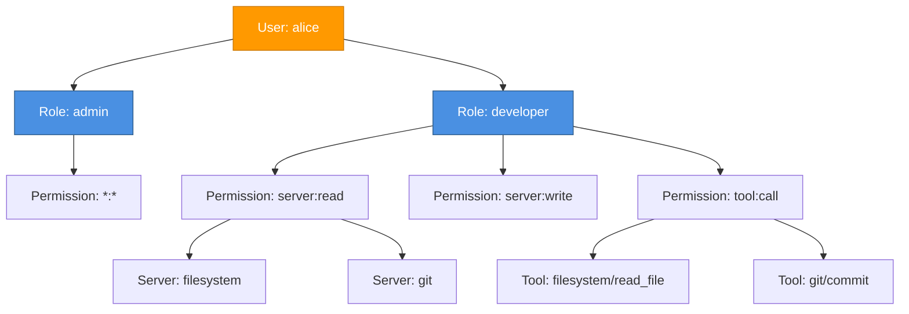

**6. Multi-Tenancy Architecture (Line ~800)**

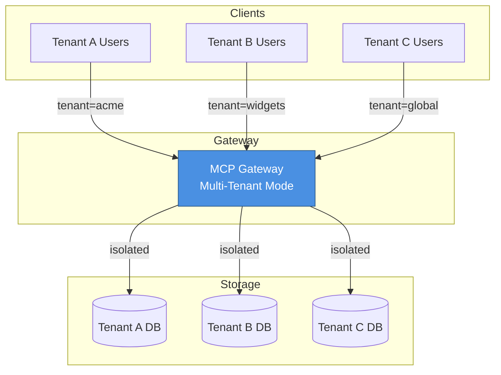

### ARCHITECTURE.md

**7. Component Architecture (Line ~30)**

Replace the large ASCII diagram with:

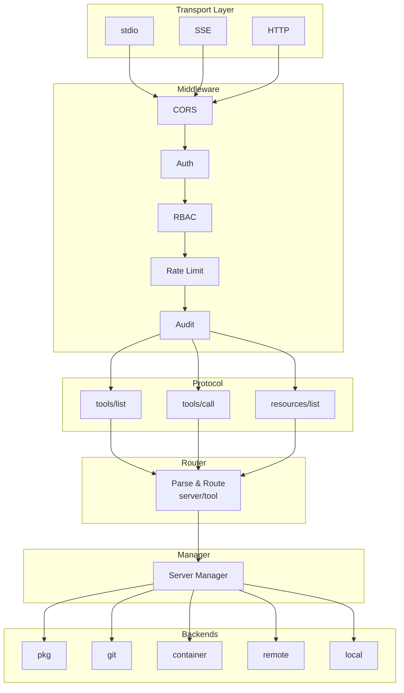

**8. Request Flow Sequence (Line ~600)**

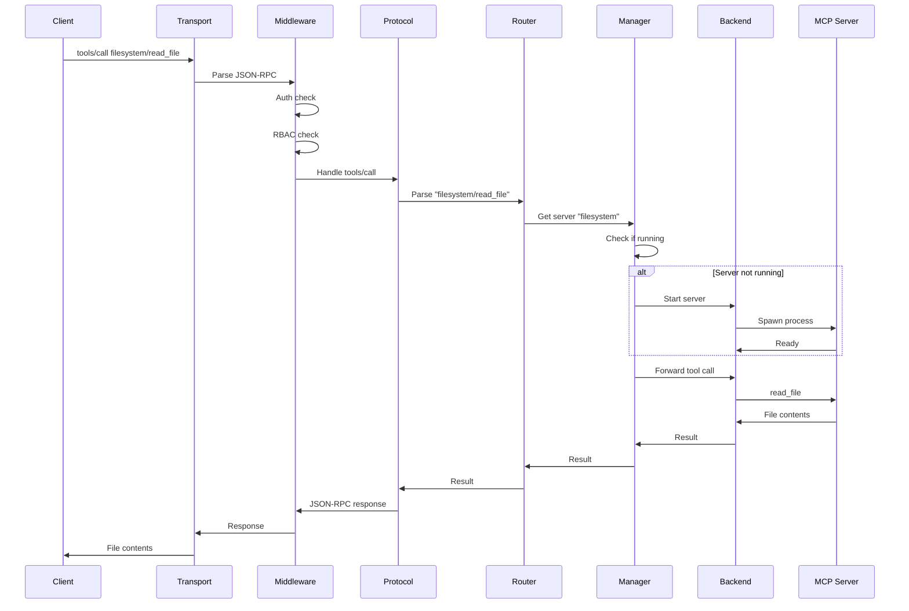

**9. Database Schema ER Diagram (Line ~750)**

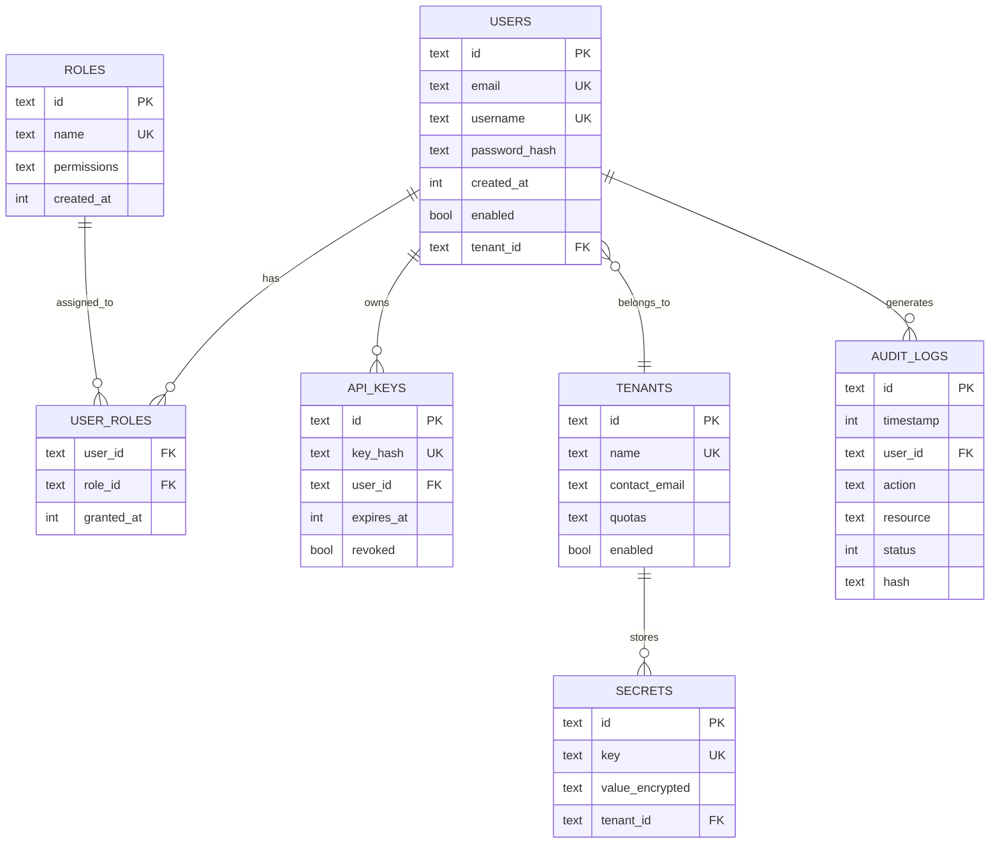

**10. Deployment Patterns (Line ~1100)**

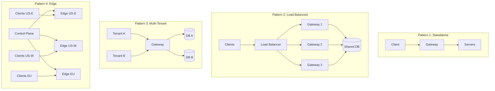

## Priority 2: Tutorial Diagrams (Important)

### oauth-github.md

**11. OAuth Flow (Line ~20)**

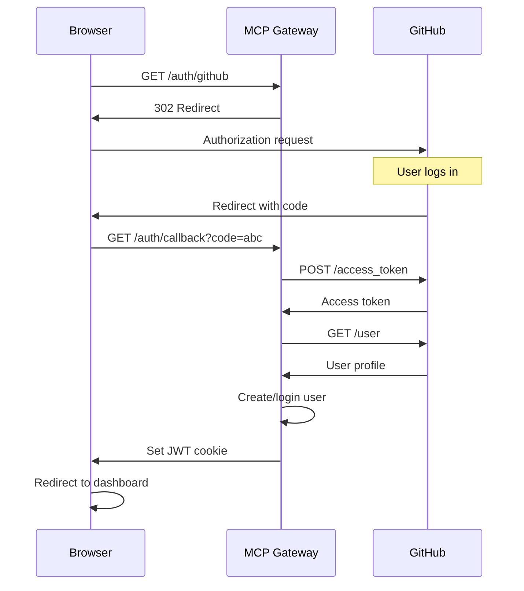

### saml-sso.md

**12. SAML Flow (Line ~15)**

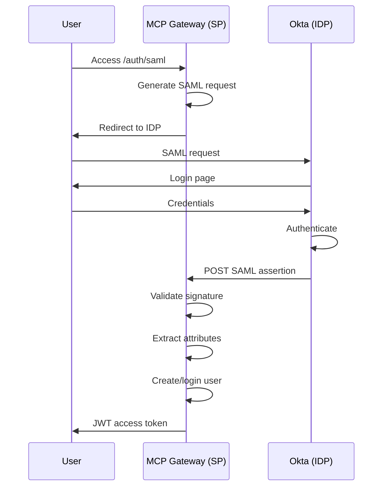

### kubernetes-deployment.md

**13. K8s Architecture (Line ~25)**

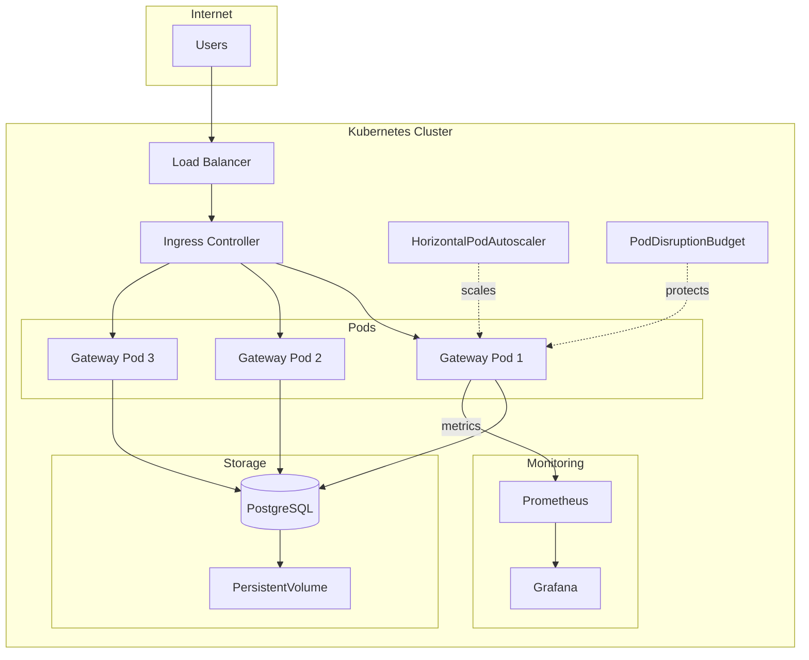

### multi-tenancy.md

**14. Tenant Isolation (Line ~30)**

```mermaid
graph TB
    subgraph Tenants
        T1[Acme Corp]
        T2[Widgets Inc]
        T3[Global Services]
    end

    subgraph Gateway Layer
        G[MCP Gateway<br/>Tenant Router]
    end

    subgraph Network Isolation
        VLAN1[VLAN 100]
        VLAN2[VLAN 101]
        VLAN3[VLAN 102]
    end

    subgraph Storage Layer
        DB1[(acme_db)]
        DB2[(widgets_db)]
        DB3[(global_db)]
    end

    subgraph Filesystem
        FS1[/data/acme]
        FS2[/data/widgets]
        FS3[/data/global]
    end

    T1 -->|192.168.1.x| G
    T2 -->|10.0.0.x| G
    T3 -->|172.16.0.x| G

    G --> VLAN1
    G --> VLAN2
    G --> VLAN3

    VLAN1 --> DB1
    VLAN2 --> DB2
    VLAN3 --> DB3

    DB1 --> FS1
    DB2 --> FS2
    DB3 --> FS3

    style G fill:#4a90e2,stroke:#2e5c8a,color:#fff
    style DB1 fill:#ff6b6b,stroke:#cc5555,color:#fff
    style DB2 fill:#51cf66,stroke:#40a84f,color:#fff
    style DB3 fill:#ffd93d,stroke:#ccad31,color:#fff
```

### monitoring-setup.md

**15. Monitoring Stack (Line ~20)**

```mermaid
graph LR
    subgraph MCP Gateway
        G[Gateway<br/>:3000]
        M[/metrics<br/>endpoint]
    end

    subgraph Prometheus
        P[Prometheus<br/>:9090]
        A[Alertmanager<br/>:9093]
    end

    subgraph Grafana
        GR[Grafana<br/>:3000]
        D[Dashboards]
    end

    subgraph Tracing
        J[Jaeger<br/>:16686]
    end

    subgraph Logging
        E[Elasticsearch]
        K[Kibana]
    end

    subgraph Alerting
        SL[Slack]
        PD[PagerDuty]
    end

    G --> M
    M -->|scrape| P
    P --> A
    A --> SL
    A --> PD
    P --> GR
    GR --> D

    G -->|traces| J
    G -->|logs| E
    E --> K

    style G fill:#4a90e2,stroke:#2e5c8a,color:#fff
    style P fill:#e85d42,stroke:#b74a35,color:#fff
    style GR fill:#f48c42,stroke:#c37035,color:#fff
```

## Priority 3: Training Material Diagrams (Nice to Have)

### MCP_Gateway_v3.0_Training.md

**16. Slide 6: Core Concepts (Line ~90)**

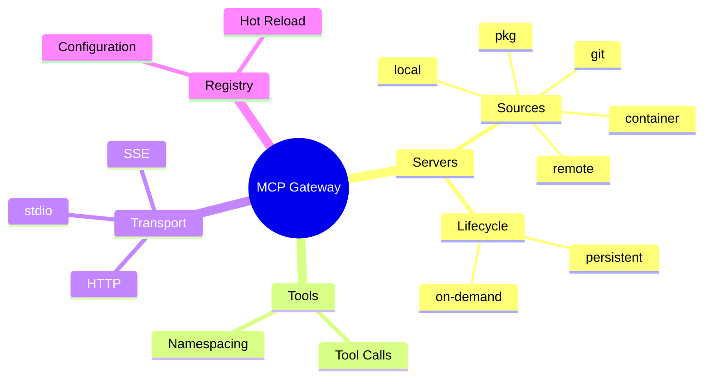

**17. Slide 16: HA Setup (Line ~270)**

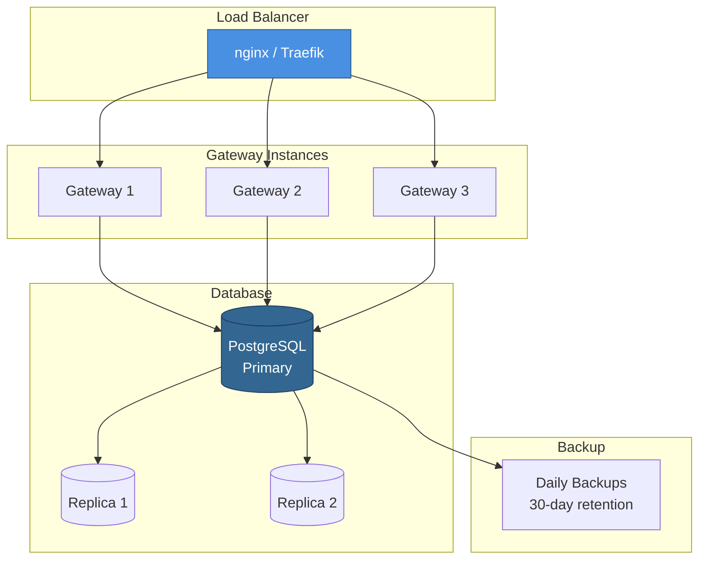

## Implementation Recommendations

### Phase 1: Critical Diagrams (Week 1)

- GETTING_STARTED.md: Architecture, OAuth flow
- USER_GUIDE.md: State machine, RBAC hierarchy
- ARCHITECTURE.md: Component architecture, request flow, ER diagram

### Phase 2: Tutorial Diagrams (Week 2)

- All 6 tutorials: Add sequence diagrams for flows
- Multi-tenancy: Isolation architecture

### Phase 3: Training Enhancements (Week 3)

- Training slides: Add mindmap and HA diagram
- Lab exercises: Add verification flow diagrams

## Benefits of Mermaid Diagrams

1. **Maintainability**: Plain text diagrams tracked in git
2. **Clarity**: Better visual representation than ASCII
3. **Rendering**: GitHub/GitLab natively render Mermaid
4. **Consistency**: Unified styling across all diagrams
5. **Accessibility**: Screen readers can parse Mermaid text
6. **Search**: Diagram content is searchable

## Migration Strategy

1. **Keep ASCII temporarily**: Don't remove until Mermaid verified
2. **Add comment**: Mark ASCII diagrams with `<!-- Legacy ASCII -->`
3. **Test rendering**: Verify on GitHub before removing ASCII
4. **Document colors**: Use consistent color scheme (defined above)
5. **Responsive**: Ensure diagrams work on mobile

## Next Steps

1. Review this plan with team
2. Prioritize diagrams by impact
3. Implement Phase 1 (critical diagrams)
4. Gather feedback
5. Roll out Phases 2 and 3
